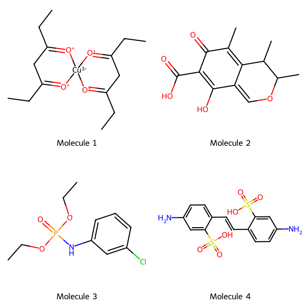

[](https://pycqa.github.io/isort/)
[](https://github.com/psf/black)
[](https://github.com/astral-sh/ruff)
[](https://opensource.org/licenses/MIT)
[](https://github.com/David-Araripe/UniProtMapper/actions)

# chemFilters

A collection of chemical filters, with some support for data visualization and analysis. At the moment, the supported filters are:

- RDKit filters based on RDKit implementation of [Pat Walter's version of the ChEMBL filters](https://github.com/PatWalters/rd_filters)*;
- Purchasability filters based on Andrew White's [molbloom](https://github.com/whitead/molbloom);
- Peptide filters based on Olivier Béquignon's [PepSift](https://github.com/OlivierBeq/PepSift);
- Silly molecules filters based Olivier's fork of Pat Water's [silly walks](https://github.com/PatWalters/silly_walks);

*note: RDKit's implementation these chemical filters is only available from rdkit version 2023.03.1 onwards. Check here for the [release notes](https://greglandrum.github.io/rdkit-blog/posts/2023-05-03-new-release-highlights.html).

## Overview:

The different filtering classes are implemented with a similar API, where `get_flagging/scoring_df` run all the filters available for that filtering class and return a dataframe that used to investigate the filters. In case of the RdkitFilters implementation, a few visualization methods are available to render the molecules, substructure matches, and molecular grids.

See available filters and visualization methods below:

- [chemFilters](#chemfilters)
  - [Overview:](#overview)
  - [Installation](#installation)
  - [Filtering Compounds](#filtering-datasets)
    - [RdkitFilters](#rdkitfilters)
    - [Purchasability filters](#purchasability-filters)
    - [Silly molecules filters](#silly-molecules-filters)
    - [Peptide filters](#peptide-filters)
  - [Visualization](#visualization)
    - [Rendering a grid of molecules;](#rendering-a-grid-of-molecules)
    - [Rendering substructure matches:](#rendering-substructure-matches)
    - [Rendering substructure matches with colors:](#rendering-substructure-matches-with-colors)

## Installation

```bash
python -m pip install git+https://github.com/David-Araripe/chemFilters.git
```

## Filtering Compounds

### RdkitFilters
``` Python
from chemFilters import RdkitFilters
from rdkit import Chem

mols = [
    Chem.MolFromSmiles("CCC1=[O+][Cu-3]2([O+]=C(CC)C1)[O+]=C(CC)CC(CC)=[O+]2"),
    Chem.MolFromSmiles('CC1=C2C(=COC(C)C2C)C(O)=C(C(=O)O)C1=O'),
    Chem.MolFromSmiles('CCOP(=O)(Nc1cccc(Cl)c1)OCC'),
    Chem.MolFromSmiles("Nc1ccc(C=Cc2ccc(N)cc2S(=O)(=O)O)c(S(=O)(=O)O)c1"),
]

rdkit_filter = RdkitFilters(filter_type='ALL', from_smi=False)
filtered_df = rdkit_filter.get_flagging_df(mols)
```

### Purchasability filters

``` Python
from chemFilters import MolbloomFilters
bloom_filter = MolbloomFilters(from_smi=False, standardize=False)
bloom_filter.get_flagging_df(mols)
```

### Silly molecules filters

``` Python
from chemFilters import SillyMolFilters
silly_filter = SillyMolFilters(from_smi=False)
silly_filter.get_scoring_df(mols)
```

### Peptide filters

``` Python
pep_filter = PeptideFilters(from_smi=False)
pep_filter.get_flagging_df(mols)
```

## Visualization

### Rendering a grid of molecules;

``` Python
from rdkit import Chem
from chemFilters.img_render import MolPlotter, MolGridPlotter

mols = [
    Chem.MolFromSmiles("CCC1=[O+][Cu-3]2([O+]=C(CC)C1)[O+]=C(CC)CC(CC)=[O+]2"),
    Chem.MolFromSmiles('CC1=C2C(=COC(C)C2C)C(O)=C(C(=O)O)C1=O'),
    Chem.MolFromSmiles('CCOP(=O)(Nc1cccc(Cl)c1)OCC'),
    Chem.MolFromSmiles("Nc1ccc(C=Cc2ccc(N)cc2S(=O)(=O)O)c(S(=O)(=O)O)c1"),
]
labels = [f"Molecule {i}" for i in range(1, len(mols) + 1)]

# Initialize grid plotter instance
grid_plotter = MolGridPlotter(
    from_smi=False,
    font_size=18,
    size=(250, 250),
    font_name="Humor-Sans", # Requires font to be installed
    label_loc="bottom",
)

img = grid_plotter.mol_grid_png(mols[:4], n_cols=2, labels=labels)
display(img)
```
<p align="center">
  
</p>

### Rendering substructure matches:

``` Python
import matplotlib.pyplot as plt

chemFilter = RdkitFilters(filter_type="ALL")
filter_names, description, substructs = chemFilter.filter_mols(mols)

grid_plotter = MolGridPlotter(
    n_jobs=1, from_smi=False, font_size=15, size=(250, 250), font_name="Humor-Sans"
)
img = grid_plotter.mol_structmatch_grid(
    mols, substructs=substructs, labels=labels, n_cols=2
)
display(img)
img.save("substruct_grid.png")
```
<p align="center">
  
</p>

### Rendering substructure matches with colors:

``` Python
from chemFilter import RdkitFilters
import matplotlib.pyplot as plt

chemFilter = RdkitFilters(filter_type="NIH")
filter_names, description, substructs = chemFilter.filter_mols(mols)

plotter = MolPlotter(
    from_smi=False, font_size=20, size=(700, 700), font_name="Humor-Sans"
)
img = plotter.render_with_colored_matches(
    mols[0],
    descriptions=description[0],
    substructs=substructs[0],
    label=labels[0],
)

plt.imshow(img)
ax = plt.gca() # get current axis
ax.set_axis_off()
plotter.colored_matches_legend(description[0], substructs[0], ax=ax)
fig = plt.gcf() # get current figure
# saving the figure
fig.savefig("colored_matches.png", bbox_inches="tight", dpi=150, facecolor="white")
```
<p align="center">
  
</p>
