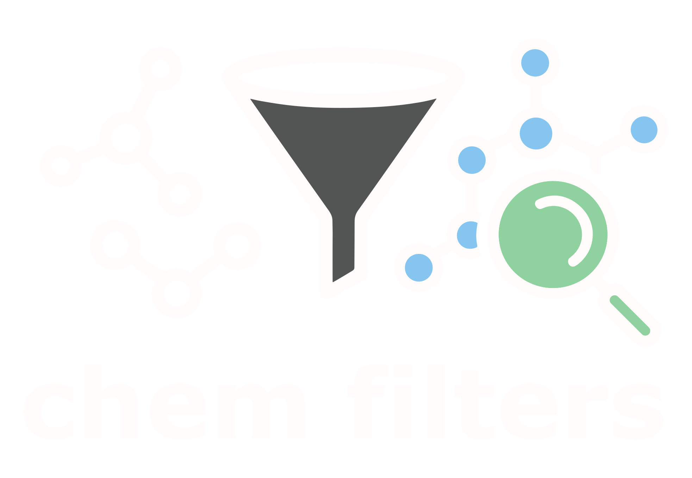

# chemFilters

```{raw} html
<div style="text-align: center; margin-bottom: 1.5em;">
  
  
  <p style="font-size: 1.2em; font-weight: bold; margin-top: 0.5em;">
    Flag issues, standardize, and visualize molecular structures with ease.
  </p>
</div>
```

A Python package wrapping several chemical structure filtering, rendering,
and standardization utilities.

## Supported filters

- RDKit [structural alert filters](https://www.rdkit.org/docs/source/rdkit.Chem.rdfiltercatalog.html)
  including BMS, Dundee, Glaxo, Inpharmatica, LINT, MLSMR, PAINS, and SureChEMBL
- Purchasability filters via [molbloom](https://github.com/whitead/molbloom)
- Peptide filters via [PepSift](https://github.com/OlivierBeq/PepSift)
- Silly molecule filters via [molspotter](https://github.com/OlivierBeq/molspotter)

```{toctree}
:maxdepth: 2
:caption: Contents

installation
usage/index
cli
api/index
```
